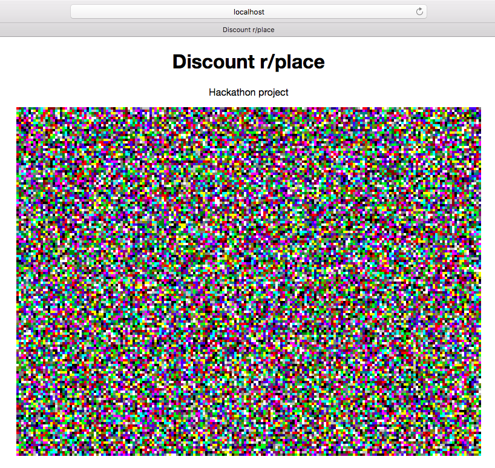

# Discount r/place

Started working on this during Hackerspace MMU Hackathon Apr '17.



## Goal
Replicate r/place like using Redux/React (very, very poor choice of technologies).

## TODO

- [X] Create frontend POC
- [ ] Create a backend
- [ ] Improve frontend performance

## How to run it

Assuming you have node.js and yarn installed.

```
$ cd into/project/path
$ yarn
$ webpack-dev-server
# Goto localhost:8080
```
